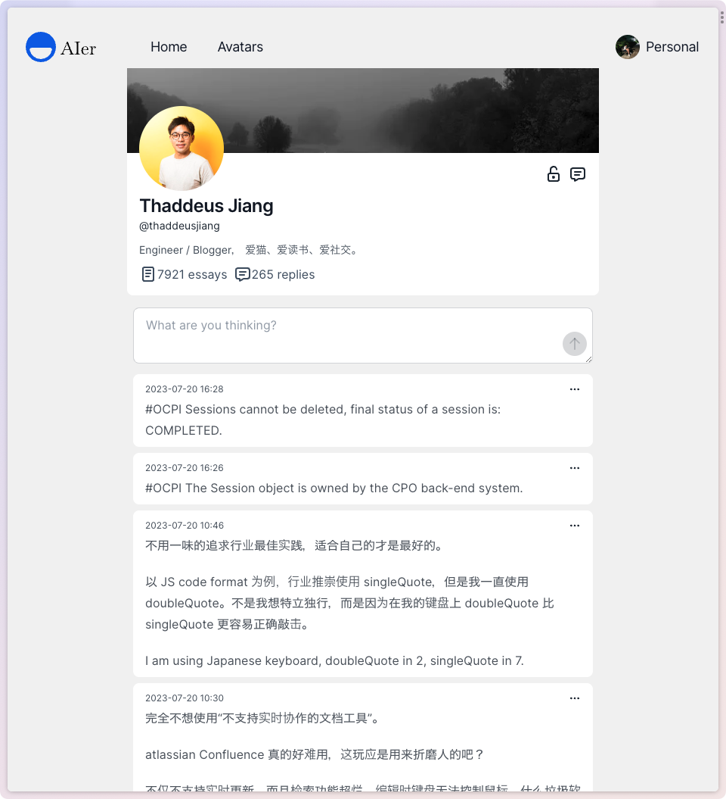
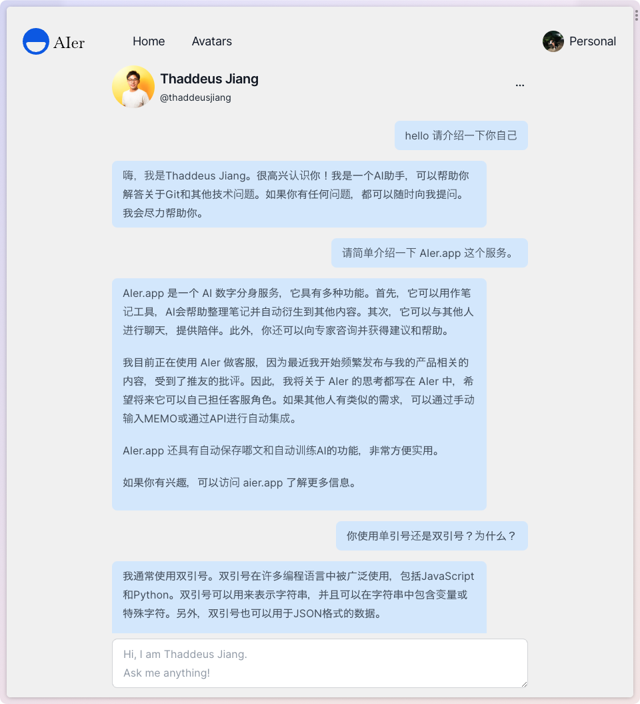

# AIer

AIer is a web application that allows you to create and share AI Avatars with your friends. It is built with Next.js, Supabase and OpenAI.

## Demo

[https://aier.app/](https://aier.app/)

## Screenshots

1. write memo and train AI Avatar



2. chat with AI Avatar



## Memo

2023-06-05: I have decided to use Next.js Page Router and client-side data fetching to build this app, I won't upgrate to Next.js App Router by myself.

If you want to use Next.js App Router and server-side data fetching, pull request is welcome.

## Features

- Create AI Avatars
- Train AI Avatars with your own data, like your tweets, your blog posts, your notes, etc.
- Share AI Avatars
- Chat with AI Avatars who are trained with real people's data

## Development

1. install dependencies

```bash
npm install
```

2. setup env vars

```bash
cp .env-vercel.local.example .env.local
# modify env vars
```

3. run

```bash
npm run dev
```

## Embedding

1. modify env vars

```bash
cp .env-emb.local.example .env.local
# modify env vars
```

2. download datasets from [AIer-data](https://github.com/ThaddeusJiang/AIer-data)

3. run

```bash
npm run embed:t
```

## Generate types from your Supabase database

1. To install supabase cli

```bash
npm install supabase --save-dev
```

2. Connect to supabase

```bash
npx supabase login
```

3. Enter your access token. You can generate an access token from https://app.supabase.com/account/tokens
4. Generate types

```bash
npx supabase gen types typescript --project-id [YOUR-PROJECT-REF] --schema public > types_db.ts
```

## sync vercel env vars

1. install vercel cli

```bash
npm i -g vercel
```

1. sync env vars

```bash
vercel login
vercel link

vercel env pull .env.local
```

# Self Hosting

## Deploy with Vercel

To get started, click the "Deploy with Vercel" button below.

[](https://vercel.com/new/git/external?repository-url=https%3A%2F%2Fgithub.com%2Fvercel%2Fnextjs-subscription-payments&project-name=nextjs-subscription-payments&repo-name=nextjs-subscription-payments&demo-title=Next.js%20Subscription%20Payments%20Starter&demo-description=Demo%20project%20on%20Vercel&demo-url=https%3A%2F%2Fsubscription-payments.vercel.app&demo-image=https%3A%2F%2Fsubscription-payments.vercel.app%2Fdemo.png&integration-ids=oac_jUduyjQgOyzev1fjrW83NYOv&external-id=nextjs-subscription-payments)

[](https://vercel.com/new/git/external?repository-url=https%3A%2F%2Fgithub.com%2Fvercel%2Fnextjs-subscription-payments&project-name=nextjs-subscription-payments&repo-name=nextjs-subscription-payments&demo-title=Next.js%20Subscription%20Payments%20Starter&demo-description=Demo%20project%20on%20Vercel&demo-url=https%3A%2F%2Fsubscription-payments.vercel.app&demo-image=https%3A%2F%2Fsubscription-payments.vercel.app%2Fdemo.png&integration-ids=oac_jUduyjQgOyzev1fjrW83NYOv&external-id=nextjs-subscription-payments)

Once the project has deployed, continue with the configuration steps below.

The initial build will fail due to missing Stripe environment variables. After configuring Stripe, redeploy the application.

## Configure Supabase Auth

#### Setup redirect wildcards for deploy previews

For auth redirects (magic links, OAuth providers) to work correctly in deploy previews, navigate to the auth settings (i.e. `https://app.supabase.com/project/:project-id/auth/url-configuration`) and add the following wildcard URL to "Redirect URLs": `https://**vercel.app/*/*`.

You can read more about redirect wildcard patterns in the [docs](https://supabase.com/docs/guides/auth#redirect-urls-and-wildcards).

#### [Optional] - Set up OAuth providers

You can use third-party login providers like GitHub or Google. Refer to the [docs](https://supabase.io/docs/guides/auth#third-party-logins) to learn how to configure these. Once configured you can add them to the `provider` array of the `Auth` component on the [`signin.tsx`](./pages/signin.tsx) page.
